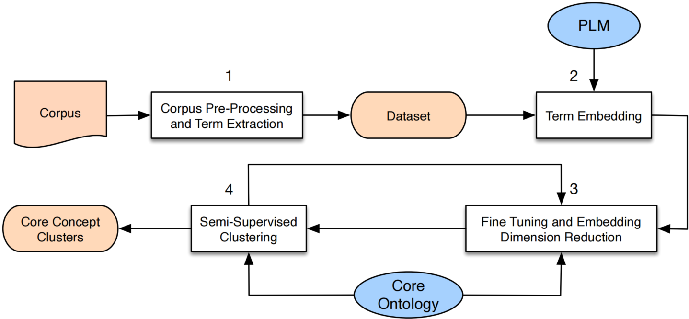

# CO-ISSC:Core Ontology-based Incremental Semi-Supervised Clustering

This is the pipeline we are going to pulish on KES 2024 conference, with a core ontology as prior knowledge, combined with UMAP and adapted C-DBSCAN.

<div align=center> 

</div> 

# File Structure
``` bash
|- Data 
|- helpers 
    |- Term
        |- CoreConcept.py : core concept extend Term class
        |- Term.py :  class Term and its funciton
        |- Vocabulary.py: 
    |- CDBSCAN.py : adaptation of CDBSCAN
    |- Corpus.py
    |- Model.py : pipeline 
|- Model : SentencBERT configurations, not needed
|- tools 
|- prosition.ipynb
|- mytest.ipynb
```

## Getting started


# Usage

To launch the code, you should install the neccesary pakages.
```bash
pip install -r requirement.txt
```


